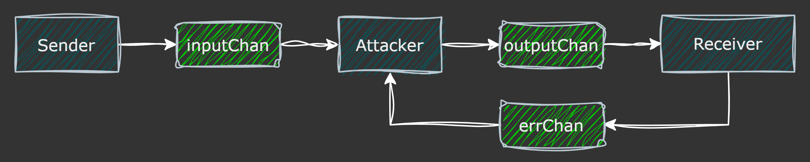

# Challenge 27

## Challenge description

> Take your code from the CBC exercise and modify it so that it repurposes the key for CBC encryption as the IV.
> 
> Applications sometimes use the key as an IV on the auspices that both the sender and the receiver have to know the key already, and can save some space by using it as both a key and an IV.
> 
> Using the key as an IV is insecure; an attacker that can modify ciphertext in flight can get the receiver to decrypt a value that will reveal the key.
> 
> The CBC code from exercise 16 encrypts a URL string. Verify each byte of the plaintext for ASCII compliance (ie, look for high-ASCII values). Noncompliant messages should raise an exception or return an error that includes the decrypted plaintext (this happens all the time in real systems, for what it's worth).
> 
> Use your code to encrypt a message that is at least 3 blocks long:
> 
> ```
> AES-CBC(P_1, P_2, P_3) -> C_1, C_2, C_3
> ```
>
> Modify the message (you are now the attacker):
> 
> ```
> C_1, C_2, C_3 -> C_1, 0, C_1
> ```
>
> Decrypt the message (you are now the receiver) and raise the appropriate error if high-ASCII is found.
> 
> As the attacker, recovering the plaintext from the error, extract the key:
> 
> ```
> P'_1 XOR P'_3
> ```
>

## Solution

The challenge description already tells us exactly how to carry out the attack, but does not entirely explain why it works, so let's prove it.

Let $P_1, P_2, P_3$ be the blocks of the plaintext message (I am using the same notation as the challenge here). The sender encrypts and sends

$$
C_1 || C_2 || C_3 = E_\text{CBC}(P_1 || P_2 || P_3, k, k)
$$

If we break this down by block, we see that

$$
\begin{align*}
C_1 &= E_\text{AES}(P_1, k) \oplus k \\
C_2 &= E_\text{AES}(P_1, k) \oplus C_1 \\
C_3 &= E_\text{AES}(P_1, k) \oplus C_2
\end{align*}
$$

As the attacker, we then modify the ciphertext blocks as follows

$$
\begin{align*}
C'_1 &= C_1 \\
C'_2 &= 0 \\
C'_3 &= C_1
\end{align*}
$$

When the receiver decrypts

$$
P'_1 || P'_2 || P'_3 = D_\text{CBC}(C'_1 || C'_2 || C'_3, k, k) = D_\text{CBC}(C_1 || 0 || C_1, k, k)
$$

each new plaintext block will look like

$$
\begin{align*}
P'_1 &= D_\text{AES}(C_1, k) \oplus k \\
P'_2 &= D_\text{AES}(0, k) \oplus C_1 = \text{scrambled garbage} \\
P'_3 &= D_\text{AES}(C_1, k) \oplus 0 = D_\text{AES}(C_1, k)
\end{align*}
$$

Since $P_2'$ gets scrambled, each byte has probability $1/2$ of being a high ASCII (value above 127) byte. So $P_2'$ has probability $1 - (1/2)^{16} \approx 0.99976$ to have at least one high ASCII byte and thus raise an error.

We can also see that $P'_1 \oplus P'_3 = (D_\text{AES}(C_1, k) \oplus k) \oplus (D_\text{AES}(C_1, k)) = k$, allowing the attacker to compute the key from the plaintext $P'_1 || P'_2 || P'_3$ in the error message.

## Simulating man-in-the-middle

This challenge asks us to simulate a man-in-the-middle scenario. I thought this would be a fun opportunity to make use of Go channels to model the passing of messages between the different actors involved.

There are three attacks, the sender, receiver, and attacker. The **sender** can send the ciphertext `[]byte` object to the channel `inputChan`. The **receiver** receives the ciphretext object from the channel `outputChan` and then decrypts it. If the receiver discovers invalid ASCII characters in the decrypted message, it sends a custom error of type `*AsciiError` containing the decrypted message to the channel `errChan`; otherwise, it sends `nil` to `errChan`.

In normal operation, we would forward messages from `inputChan` to `outputChan` (or just make them point to the same channel object). However, to model the intervention of an attacker, we allow the attacker to receive ciphertexts from `inputChan`, modify them, and then forward them to `outputChan`. We also allow the attacker to receive error messages from `errChan`.

This setup is summarized in this flowchart:



All of these channels are unbuffered, so sending on them blocks. Thus, we run the sender, receiver, and attacker each in seperate goroutines. We use a `WaitGroup` to wait for all three goroutines to finish before exiting.

### Uni-directional channels

The attacker function is provided an object of the following type from the simulation:

```go
type AttackerChans struct {
	InputChan  <-chan []byte
	OutputChan chan<- []byte
	ErrorChan  <-chan error
}
```

The cool thing about this is that even though the original channels are all bidirectional (since one actor sends to channel and another receives from it) the attacker function is only provided uni-directional references to these channels. For instance, the attacker can only receive from `InputChan` and can only send to `OutputChan`. This of course is no means to provide actual security; we are running everything in the same address space anyway so the boundaries between the sender/reciever/attacker are merely imaginary. Instead, this is moreso a nice way to help prevent _accidentally_ using the channels incorrectly in the attacker code.
